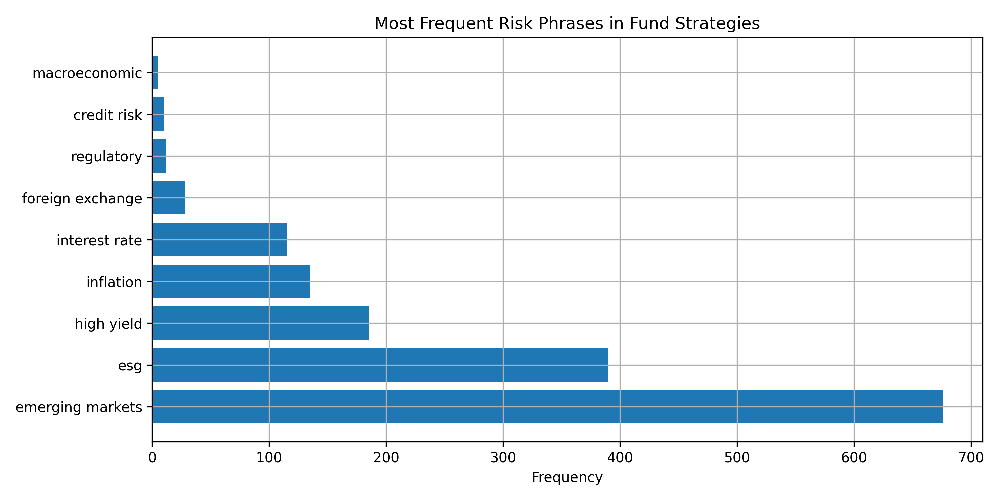
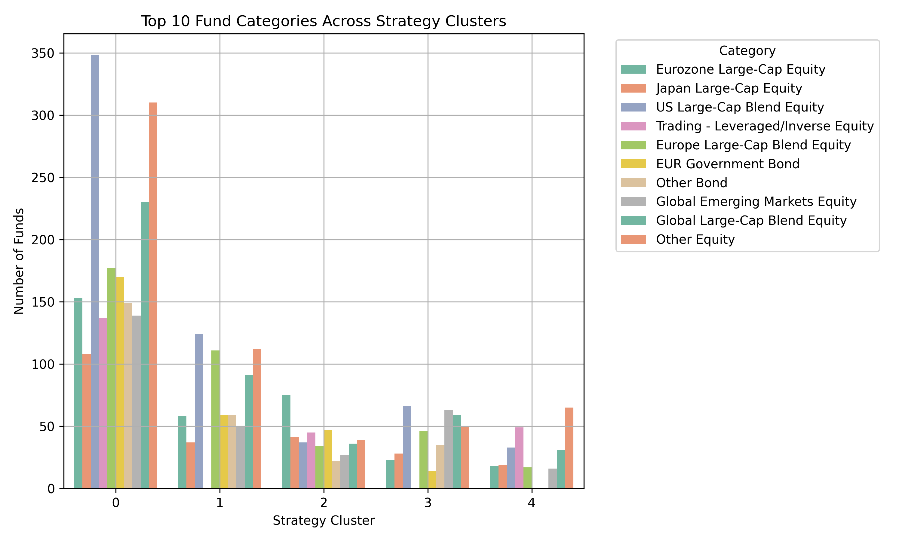
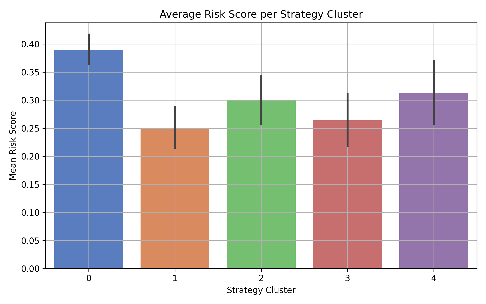

# Fund Strategy Clustering and Risk Profiling Using NLP

This project applies natural language processing and unsupervised learning to analyze investment strategy descriptions from mutual fund data. It extracts key risk-related language, identifies thematic clusters of funds using text features, and computes a quantitative risk score for each fund based on strategy content.

---

## Objective

To convert unstructured mutual fund strategy descriptions into structured, actionable insights that support:

- Risk profiling based on language
- Thematic clustering of funds beyond traditional categories
- Visualization of fund category distribution across strategy themes

---

## Data

- Source: https://www.kaggle.com/datasets/stefanoleone992/european-funds-dataset-from-morningstar
- - Size: ~1,000+ records
- Preprocessing: Lowercased, cleaned text; null values removed

---

## Methodology

### 1. Risk Phrase Extraction
- Defined a domain-specific vocabulary of 13+ risk phrases (e.g., *emerging markets*, *liquidity risk*)
- Extracted terms using rule-based matching

### 2. Text Vectorization
- Applied `TfidfVectorizer` to transform strategy text into numeric feature space

### 3. Unsupervised Clustering
- Used `KMeans` to group strategies into 5 distinct clusters based on textual patterns
- Interpreted clusters by extracting top terms per cluster

### 4. Risk Scoring
- Assigned weights to extracted terms
- Computed an aggregate `risk_score` per fund to quantify risk from text

---

## Key Insights

- **Risk Trends**: "Emerging markets", "high yield", and "ESG" are the most common risk themes.
- **Strategy Clusters**: Funds group into 5 interpretable clusters reflecting aggressive, defensive, ESG-oriented, and global strategies.
- **Category Distribution**: High-risk clusters are heavily populated by *Global Emerging Markets* and *Trading/Leveraged* funds.
- **Quantified Risk**: Text-based `risk_score` provides a consistent, scalable way to measure qualitative fund risk.

---

## Tools Used

- Python (pandas, sklearn, matplotlib, seaborn)
- NLP: TF-IDF vectorization, domain-specific keyword matching
- ML: KMeans clustering
- Data Visualization

---

## Sample Visuals

### Top Risk Terms by Frequency

### Fund Category Distribution by Strategy Cluster

### Average Risk Score per Cluster

---

## Applications

- Enhance fund screeners with text-based risk signals
- Supplement analyst ratings with strategy-derived cluster insights
- Automate thematic tagging of funds based on strategy language
- Power portfolio construction tools with qualitative risk alignment
